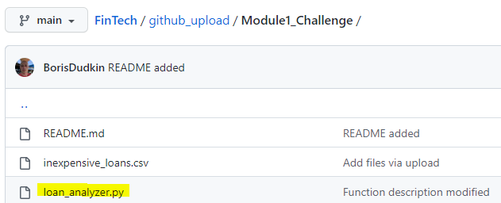
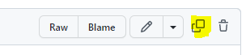
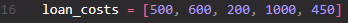
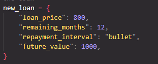
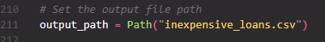

##  **Loan Analizer**


Finance professionals are often requited to analyze different characterisitcs of a large number of loans. This task can be time consuming and tedious.
Loan Analizer tool is built to streamline those analyzes and make a job of an analist more efficient and enjoyable.

---


---

## Table of contents

1. [Technologies](#technologies)
2. [Installation Guide](#installation-guide)
3. [Getting Started](#getting-started)
4. [Usage](#usage)
5. [Contributors](#contributors)
6. [License](#license)

---

## Technologies

`Python 3.9.13`

_Prerequisites_

- csv

## Installation Guide

Open your terminal.
To install csv type:

```python
pip install python-csv
```

Press **Enter** to install

## Getting Started

- Once within the fintech repository on the GitHub scroll to `loan_analyzer.py` within the github_upload folder and click on hyperlink <br />
  
- Create a new .py file in your code editor
- Copy the code and paste it in the newly created .py file <br />
  
- Within the code update the list and dictionary with the relevant loan information <br />
  
  
- Within the code select the path on your PC for the output file <br />
  
- Save the .py on your local PC if required

Alternatively, clone the repository and run the **loan_analyzer.py**

## Usage

The code can be used for the following purposes:

- Given a list of loans, calculate the total number of loans, total cost of the portfolio and an average loan price
- Analyze the loan to determine the investment value:
  - Determine the fair value of the loan given its future value, investment horizon and a hurdle discount rate;
  - Compare the present value to the cost of the loan to make an investment decision
- Select loans for investment by using a price criteria
- Save the results in a csv document in a specified location on your PC

## Contributors

Conttact Details:

- [Email](boris.dudkin@gmail.com)
- [LinkedIn](www.linkedin.com/in/Boris-Dudkin)

## License

MIT
